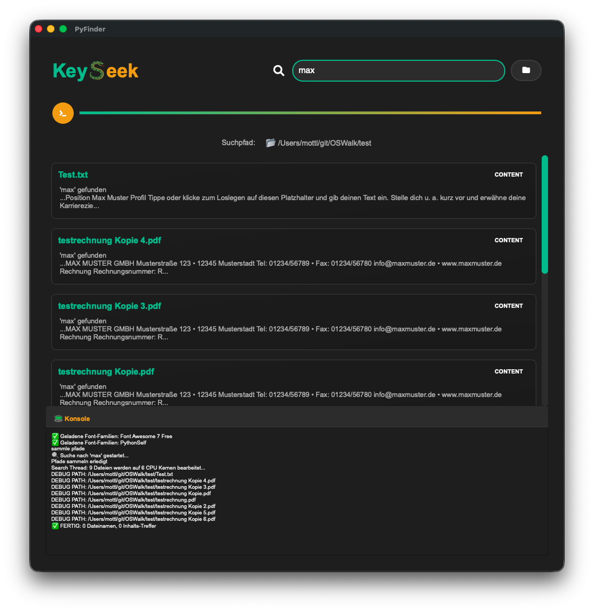

# OSWalk

Suchmaschine für den PC.
Eine Anwendung zum rekursiven Durchsuchen von Dateiinhalten in einem ausgewählten Ordner.
Ein Release zum Installieren sollte es bis 04 2026 geben.

## Features

- **Unterstützt Linux MacOSX Windows** - Suchmaschine für einen PC die wie Web Suchmaschinen funktioniert
- **Volltextsuche** - Dateien werden eingelesen und nach bestimmten Keywords durchsucht
- **GUI-Oberfläche** - Auswahl eines Hauptordners für die rekursive Suche
- **PDF-Suche** - Speziell: Suche nach Kundennummern Namen usw. im PDF Inhalt
- **optional OCR-Integration** - Texterkennung in PNG-Bildern mit pytesseract
- **Terminal** - print() wird in Console in GUI übergeben
- **Dateiformate** - können nach Belieben eingebaut werden vorerst alles was textract unterstützt
- **Suchtreffer** - Treffer im Dateinamen werden nicht im Inhalt durchsucht. Diese werden übersprungen
- **Multiprocessing und Multithreading** - für schnelles Suchen

## TODOs bis Release
- print Terminal Ausgaben unvollständig
- Code Review und Kommentierung
- Keyword Suche hat noch kein Ranking beste treffer oben ...
- Wenn nur ein Keyword im Filename gefunden wird und es gibt mehrere, dann dennoch Inhalt mitdurchsuchen

## Screenshot App Main Page
### PySide (enthällt auch QSS zum Stylen) und wird für die App jetzt verwendet

### bootstrapttk Design wird nicht mehr verwendet für die App

