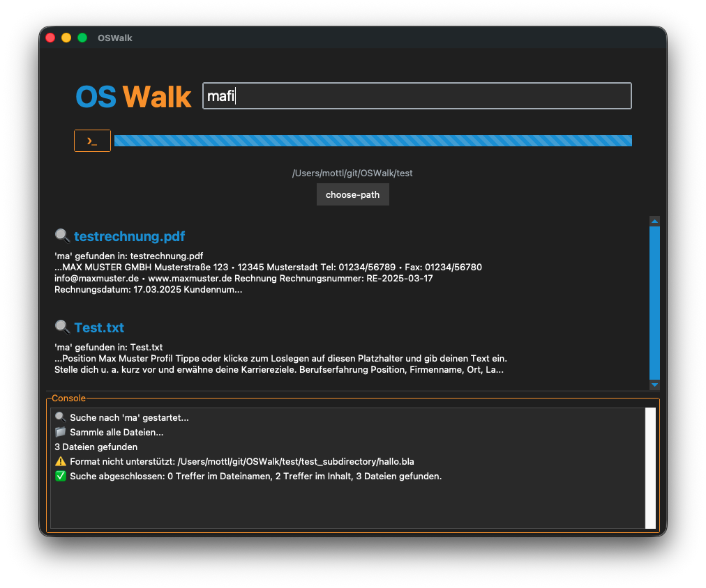

# KeySearch App

Desktop search engine.

A desktop application for recursively searching file contents inside a selected folder.  
An installable release is planned for **04/2026**.

## Features

- **Supports Linux, macOS, and Windows** – A desktop search engine that works similarly to web search engines
- **Full-text search** – Files are read and searched for specific keywords
- **Search depth** – Can be limited to a certain number of characters (e.g. search only the first 500 characters of a document)
- **GUI interface** – Select a root folder for recursive searching
- **PDF search** – Especially useful for searching customer numbers, names, etc. inside PDF documents
- **Optional OCR integration** – Text recognition in PNG images using pytesseract
- **Terminal output** – `print()` output is forwarded to a console inside the GUI
- **File formats** – Additional formats can easily be added. Most common formats are already implemented (except most image formats)
- **Search result behavior** – If a match is found in the filename, the file content is skipped
- **Multiprocessing & multithreading** – Enables fast searching
- **Dark / Light theme** – Automatically switches with the operating system theme
- **Priority system** – Ranking is calculated based on the position of the search terms

    Example calculation:
    
    (3 + 2 + 1 = 6) → normalized to a maximum priority of **1.0**
    
    If only `(pattern)` is found:
    
    2 / 6 = 0.33 → rounded to **0.3**
    
    This behavior can be disabled in the settings.

- **Settings menu** – Configure default values such as search depth, snippet size, path, and language
- **Content search logic**
  - If calculated priority **< 0.5**, a **content search** is performed
  - If priority **> 0.5**, the match is treated as a **filename match** and content search is skipped
  - If nothing is found in the file path or filename, content search is always performed
- **Language packs** – Implemented using JSON files  
  - Example: `English.json`  
  - Loaded using a `Language.get()` method  
  - The settings menu automatically lists all `*.json` language files in a dropdown

## TODO before Release

- Terminal `print` output not fully implemented
- Code review and documentation/comments

## Screenshots

### PySide (currently used for the application, including QSS styling)

  
  

### bootstrapttk design (no longer used)

